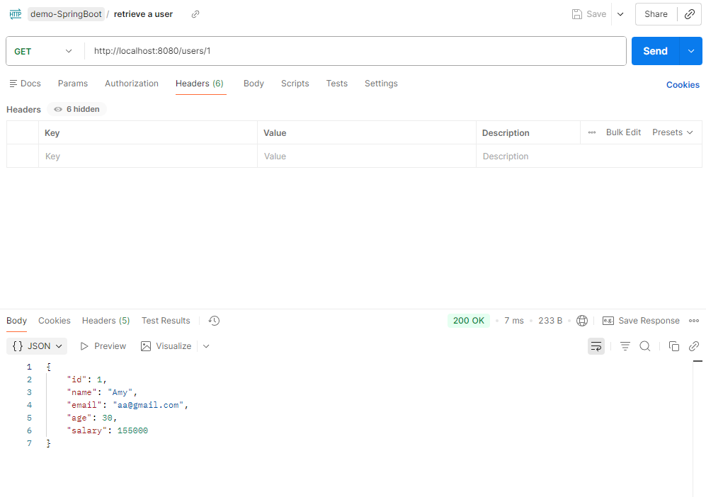
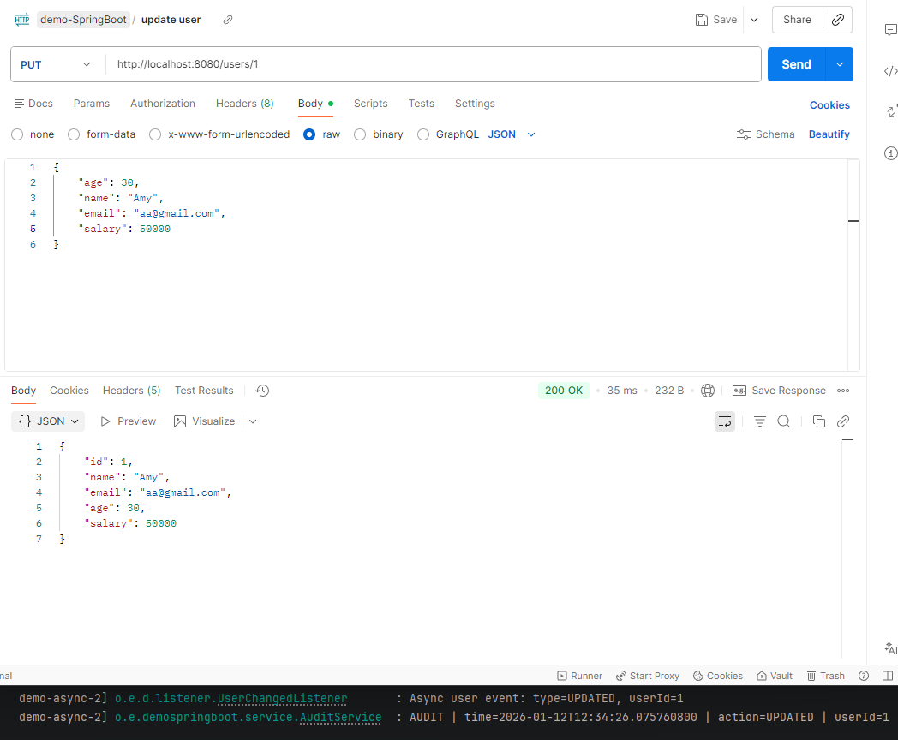

# demo-SpringBoot
This project is a demo for SpringBoot application.

## Endpoints
### localhost:8080
- retrieve all users ```GET /users?sort=id,asc (by default)```
- retrieve a user by its id ```GET /users/{id}```
- create a user ```POST /users```
- update a specific user's info ```PUT /users/{id}```
- delete a user ```DELETE /users/{id}```

### Actuator
health checks ```http://localhost:8090/manage/health``` \
info ```http://localhost:8090/manage/info```

## Setup
- Java 17
- maven

## Test
- Create a user

- retrieve a user

- update a user

- retrieve all users

- delete a user


## Dependencies
- Spring Web
- Spring Data JPA
- Springboot Validation
- Springboot Actuator 
- H2 Driver
- Lombok